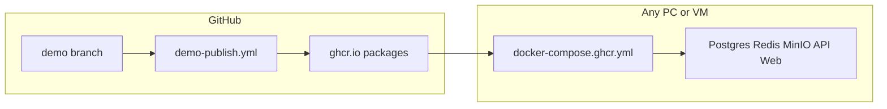

# GHCR Demo Deploy Guide

Build demo images in GitHub Actions, publish to GitHub Container Registry (GHCR), and run the full stack on **any PC** or a **cloud VM** — no Node.js, no Nx build, no repo clone required.

| Audience | Section |
|----------|---------|
| **You (maintainer)** | [Part A — GitHub + GHCR setup](#part-a-maintainer-github--ghcr-setup-one-time) |
| **Evaluators / prospects** | [Part B — Run on any PC](#part-b-evaluator-run-demo-on-any-pc) |
| **Remote demos** | [Part C — Cloud VM with public URL](#part-c-remote-demo-cloud-vm) |

**Related:** [Demo README](./README.md) · [Demo data catalog](./demo-data-catalog.md) · [docker-compose.ghcr.yml](../../docker-compose.ghcr.yml)

---

## Architecture



| Component | Source | Notes |
|-----------|--------|-------|
| API + Web | GHCR (`:demo` tag) | Built by GitHub Actions |
| Postgres, Redis, MinIO | Docker Hub | Pulled automatically by compose |
| Demo data | API container start | Migrations + `seed-demo` on first boot |

**Published images**

| Image | Tag |
|-------|-----|
| `ghcr.io/icors2/businesssuite-api` | `demo` |
| `ghcr.io/icors2/businesssuite-web` | `demo` |

---

## Part A — Maintainer: GitHub + GHCR setup (one-time)

### Prerequisites

- Repository: [github.com/icors2/BusinessSuite](https://github.com/icors2/BusinessSuite)
- Long-lived **`demo`** branch with Phase 18 demo stack
- GitHub Actions enabled for the repo

### 1. Confirm the publish workflow

The workflow lives at [`.github/workflows/demo-publish.yml`](../../.github/workflows/demo-publish.yml) on the **`demo`** branch.

It builds and pushes both images when:

| Trigger | When to use |
|---------|-------------|
| Push to `demo` | Every merge to demo branch |
| Tag `demo-v*` (e.g. `demo-v0.1.0`) | Versioned release snapshots |
| **Actions → Demo Publish → Run workflow** | Manual rebuild without a commit |

Required permissions (already configured):

```yaml
permissions:
  contents: read
  packages: write
```

### 2. Make GHCR packages public (required for “any PC”)

By default, GHCR packages are **private**. Evaluators cannot pull without a GitHub login unless you publish them.

**For each package** (`businesssuite-api`, `businesssuite-web`):

1. Open GitHub → your profile **icors2** → **Packages**
2. Click the package name
3. **Package settings** (right sidebar)
4. **Change visibility** → **Public** → confirm

Alternatively: **Repo → Settings → Actions → General → Workflow permissions** — ensure workflows can write packages (default with `GITHUB_TOKEN`).

**If packages stay private**, evaluators must:

```bash
echo YOUR_GITHUB_PAT | docker login ghcr.io -u YOUR_GITHUB_USERNAME --password-stdin
```

The PAT needs the **`read:packages`** scope.

### 3. Trigger a build

**Option A — push to demo**

```bash
git checkout demo
git push origin demo
```

**Option B — tag a release**

```bash
git checkout demo
git tag demo-v0.1.1
git push origin demo-v0.1.1
```

**Option C — manual**

1. GitHub → **Actions** → **Demo Publish**
2. **Run workflow** → branch `demo` → **Run workflow**

### 4. Verify the build

1. Open **Actions** → latest **Demo Publish** run → all steps green
2. Open **Packages** → confirm both images have tag **`demo`**
3. Optional: pull locally to confirm

```bash
docker pull ghcr.io/icors2/businesssuite-api:demo
docker pull ghcr.io/icors2/businesssuite-web:demo
```

### 5. Release cadence (recommended)

- Tag `demo-vX.Y.Z` after meaningful demo seed or tutorial changes
- Keep `demo` tag always pointing at latest successful build on the branch
- Document the tag in release notes when demoing to prospects

---

## Part B — Evaluator: Run demo on any PC

### Prerequisites

| Requirement | Details |
|-------------|---------|
| Docker | [Docker Desktop](https://www.docker.com/products/docker-desktop/) (Windows/Mac) or Docker Engine + Compose plugin (Linux) |
| Ports | **8080** (web) and **3000** (API) available on localhost |
| RAM | 4 GB+ free for containers |
| Network | Internet access to pull images (GHCR + Docker Hub) |

### One command (no clone)

**Linux / macOS / Git Bash:**

```bash
curl -fsSL -o docker-compose.ghcr.yml \
  https://raw.githubusercontent.com/icors2/BusinessSuite/demo/docker-compose.ghcr.yml \
  && docker compose -f docker-compose.ghcr.yml up -d --pull always
```

**Windows PowerShell:**

```powershell
Invoke-WebRequest -Uri "https://raw.githubusercontent.com/icors2/BusinessSuite/demo/docker-compose.ghcr.yml" -OutFile docker-compose.ghcr.yml; docker compose -f docker-compose.ghcr.yml up -d --pull always
```

**Helper scripts** (from a repo clone):

```bash
# Linux / macOS
bash scripts/run-demo-ghcr.sh

# Windows
.\scripts\run-demo-ghcr.ps1
```

### Clone option

```bash
git clone -b demo https://github.com/icors2/BusinessSuite.git
cd BusinessSuite
docker compose -f docker-compose.ghcr.yml up -d --pull always
```

### First boot

1. Wait **1–2 minutes** on first start (Postgres ready → migrations → demo seed)
2. Open **http://localhost:8080**
3. Sign in with demo users (password = role + `123!`):

| Email | Password | Role |
|-------|----------|------|
| admin@arcncode.local | Admin123! | Admin |
| manager@arcncode.local | Manager123! | Manager |
| operator@arcncode.local | Operator123! | Operator |
| supervisor@arcncode.local | Supervisor123! | Supervisor |

4. Use **Tutorials** in the header or visit `/tutorials` for guided module tours
5. Sample entities: `SO-DEMO-001`, `Q-DEMO-001` — see [demo-data-catalog.md](./demo-data-catalog.md)

**Health checks**

```bash
curl http://localhost:3000/api/health
docker compose -f docker-compose.ghcr.yml ps
docker logs anc-demo-api --tail 50
```

### Stop or reset

```bash
# Stop containers (keep demo data)
docker compose -f docker-compose.ghcr.yml down

# Stop and wipe database (fresh demo seed on next up)
docker compose -f docker-compose.ghcr.yml down -v
```

**Windows PowerShell** (same commands):

```powershell
docker compose -f docker-compose.ghcr.yml down
docker compose -f docker-compose.ghcr.yml down -v
```

**Local build** (`docker-compose.demo.yml`):

```bash
docker compose -f docker-compose.demo.yml down
docker compose -f docker-compose.demo.yml down -v
```

### Troubleshooting

| Symptom | Likely cause | Fix |
|---------|--------------|-----|
| `denied` / `unauthorized` on pull | Private GHCR packages | Maintainer: set packages **Public**, or `docker login ghcr.io` |
| Port 8080 already in use | Another service | Change web port in compose: `"9090:80"` |
| Web up but login fails | API still seeding | Wait 60s; check `docker logs anc-demo-api` |
| API unhealthy | Postgres not ready | `docker compose -f docker-compose.ghcr.yml ps`; restart api |
| Windows path errors | Docker not using WSL2 backend | Docker Desktop → Settings → use WSL2 engine |
| `curl` compose 404 | Wrong branch / file not pushed | Use `demo` branch raw URL or clone repo |

---

## Part C — Remote demo: Cloud VM

Use a small Linux VPS when you need to share the demo with someone who cannot run Docker locally, or when you want a stable URL for a sales call.

### 1. Provision a VM

| Spec | Minimum |
|------|---------|
| OS | Ubuntu 22.04 LTS (or similar) |
| RAM | 4 GB |
| Disk | 20 GB |
| Ports | **8080** inbound (and **22** for SSH) |

Examples: AWS EC2, Azure VM, DigitalOcean Droplet, Hetzner Cloud.

### 2. Install Docker

```bash
# Ubuntu — Docker official convenience script
curl -fsSL https://get.docker.com | sh
sudo usermod -aG docker "$USER"
# Log out and back in, then verify:
docker compose version
```

### 3. Open firewall

**UFW (Ubuntu):**

```bash
sudo ufw allow 22/tcp
sudo ufw allow 8080/tcp
sudo ufw enable
```

Restrict **8080** to your prospect's IP if possible:

```bash
sudo ufw allow from PROSPECT_IP to any port 8080
```

### 4. Start the demo

SSH into the VM and run the [one-liner from Part B](#one-command-no-clone).

### 5. Share the URL

```
http://YOUR_VM_PUBLIC_IP:8080
```

Provide login credentials from the table in Part B.

### 6. Security (read before exposing to the internet)

- JWT secrets in compose are **fixed demo values** — not safe for production
- Demo includes predictable passwords — treat as **evaluation only**
- Tear down the VM or run `docker compose -f docker-compose.ghcr.yml down -v` after the session
- Prefer IP allowlisting or VPN over wide-open public access
- Do not store real customer data in the demo stack

### Optional: HTTPS with a domain

If you have a domain pointing at the VM, put a reverse proxy in front of port 8080:

```nginx
# Minimal pattern — /etc/nginx/sites-available/demo
server {
    listen 443 ssl;
    server_name demo.example.com;
    # ssl_certificate / ssl_certificate_key ...
    location / {
        proxy_pass http://127.0.0.1:8080;
        proxy_set_header Host $host;
        proxy_set_header X-Real-IP $remote_addr;
    }
}
```

[Caddy](https://caddyserver.com/) can automate TLS with Let's Encrypt in fewer lines. This is optional; HTTP on `:8080` is enough for internal demos behind a VPN.

### 7. Cleanup

```bash
docker compose -f docker-compose.ghcr.yml down -v
# Then stop or delete the VM in your cloud console
```

---

## Security / dependencies

- CI runs `npm audit --omit=dev --audit-level=high` on production dependencies ([`.github/workflows/ci.yml`](../../.github/workflows/ci.yml)).
- Transitive dev-tool vulnerabilities (Jest/Nx/webpack) are pinned via `overrides` in [`package.json`](../../package.json).
- Major upgrades deferred by policy: Prisma 7, Jest 30, Tailwind 4.

---

## Maintainer vs local build

| Goal | Command |
|------|---------|
| **Evaluate / demo** (pull GHCR) | `docker compose -f docker-compose.ghcr.yml up -d --pull always` |
| **Stop GHCR demo** (keep data) | `docker compose -f docker-compose.ghcr.yml down` |
| **Reset GHCR demo** (wipe volumes) | `docker compose -f docker-compose.ghcr.yml down -v` |
| **Develop demo stack** (build locally) | `docker compose -f docker-compose.demo.yml up --build -d` |
| **Stop local demo** (keep data) | `docker compose -f docker-compose.demo.yml down` |
| **Reset local demo** (wipe volumes) | `docker compose -f docker-compose.demo.yml down -v` |

Use [`docker-compose.demo.yml`](../../docker-compose.demo.yml) when changing Dockerfiles or testing image builds on your machine. Use [`docker-compose.ghcr.yml`](../../docker-compose.ghcr.yml) for everyone else.

---

## Quick reference

```bash
# Maintainer — trigger rebuild
git push origin demo

# Evaluator — one line
curl -fsSL -o docker-compose.ghcr.yml \
  https://raw.githubusercontent.com/icors2/BusinessSuite/demo/docker-compose.ghcr.yml \
  && docker compose -f docker-compose.ghcr.yml up -d --pull always

# Open demo
open http://localhost:8080   # macOS
start http://localhost:8080  # Windows

# Stop (keep demo data)
docker compose -f docker-compose.ghcr.yml down

# Stop and wipe volumes (fresh seed on next up)
docker compose -f docker-compose.ghcr.yml down -v

# Local build — stop / reset
docker compose -f docker-compose.demo.yml down
docker compose -f docker-compose.demo.yml down -v
```
